# Landslide Early Warning & Monitoring Platform (NER Pilot: Aizawl)
## Comprehensive Technical Status Report & Remaining Prototype Scope

**Event Date:** 5 September 2026 (Morning Presentation)  
**Reporting Timestamp:** 4 September 2026, 13:45 IST  
**Target Pilot District:** Aizawl, Mizoram (UTM Zone 46N / EPSG:32646, EPSG:4326)  
**Roles & Ownership:**
- **Vishwajeet:** Project Lead & Backend / Database / Integration Lead
- **Rudra:** Machine Learning & Hydrological Modeling Lead
- **Riya:** Frontend Dashboard & User Experience Lead

---

## 1. Executive Summary

As of 4 September 2026, the **core intelligence, scientific evaluation, data integrity, and compliance backbone** of the platform is **100% built, verified, and merged on `main`**.

All 15 steps of the backend engineering roadmap (**Steps V0 through V14**) and all 8 steps of the ML model pipeline (**Steps R1 through R8**) are complete. The end-to-end integration was validated via **Checkpoint I3**, passing all 6 narrative beats across **156 database-backed automated tests (0 failures)**.

The remaining work for the prototype is strictly focused on **Frontend UI completion (Riya's Track: Steps F1–F7)** and **final end-to-end rehearsal**.

---

## 2. Work Completed Till Now

```
========================================================================================
                                PIPELINE STATUS OVERVIEW
========================================================================================
 [ML Track: Rudra]            [Backend & DB: Vishwajeet]          [Frontend: Riya]
 R1: Environment Setup  [OK]  V0-V3.6: Fastify + PostGIS [OK]     F1: Vite Scaffold    [TODO]
 R2: Aizawl DEM Prep    [OK]  V4-V5: Schema & Migrations [OK]     F2: MapLibre Map     [TODO]
 R3: Slope Units        [OK]  V6: Spatial API (GeoJSON)  [OK]     F3: Risk Heatmap     [TODO]
 R4: 3-Tank SWI Model   [OK]  V7: ML Ingestion API (422) [OK]     F4: Decision Card    [TODO]
 R5: Susceptibility Idx [OK]  V8-V9: Risk Matrix (L x C) [OK]     F5: Snake Line Chart [TODO]
 R6: Failure Prob (0-1) [OK]  V10: JWT & RBAC Security   [OK]     F6: Officer Review   [TODO]
 R7: Snake Trajectory   [OK]  V11: Human Verification    [OK]     F7: Alert Modal      [TODO]
 R8: Contract JSON      [OK]  V12: Alert Safety Gate     [OK]     ---------------------------
                              V13: Immutable Audit Log   [OK]     [Integration & Rehearsal]
                              V14: CAP 1.2 & 3-Lang SMS  [OK]     Checkpoint I3: E2E   [OK]
========================================================================================
```

### A. Backend Engineering & Database Architecture (V0–V14) — 100% Done
*Lead: Vishwajeet | Git: `origin/main` (commit `b263808`)*

1. **High-Performance Server & Spatial DB (`V0–V3.6`):**
   - Built on Node 22 ESM + Fastify v5 with native HTTP connection management.
   - Containerized PostgreSQL 16 + PostGIS 3.4 (`landslide-db`) with connection pooling and graceful SIGTERM shutdown (sub-second exit with PID 1 termination safety).
   - Live health probe (`GET /health`) reporting database latency and PostGIS extension version (`3.4.3`).
2. **Deterministic Migrations & Relational Integrity (`V4–V5`):**
   - 10 sequential SQL migrations (`001_init.sql` to `010_mock_sms_dispatch.sql`).
   - Domain integrity constraints:
     - `CHECK (probability BETWEEN 0 AND 1)`
     - `CHECK (confidence_lower <= confidence_upper)`
     - `CHECK (status <> 'DISPATCHED' OR authorised_by IS NOT NULL)`
     - `CHECK (action IN ('PREDICTION_VERIFIED', 'ALERT_AUTHORISED', 'ALERT_REJECTED', 'ALERT_DISPATCHED'))`
   - Spatial GiST indexes on boundary geometries in EPSG:4326 with UTM 46N metric calculations.
3. **Slope Unit Spatial API (`V6`):**
   - `GET /api/v1/slope-units?district=aizawl` streaming PostGIS-generated GeoJSON FeatureCollection with 22 morphological attributes (TWI, elevation, relief, lithology, aspect).
4. **ML Ingest Engine & Anti-Leakage Gate (`V7`):**
   - `POST /api/v1/predictions/ingest` with Fastify 422 schema formatters.
   - Enforces temporal cutoff integrity (`input_cutoff_ts`) to mathematically guarantee zero future data leakage.
5. **The Scientific Risk Engine ($L \times C$) & Exposure Module (`V8–V9`):**
   - Ingests OSM building footprints, roads, and critical facilities.
   - Computes empirical runout envelopes and evaluates consequence bands ($C1$ to $C4$) vs likelihood bands ($L1$ to $L4$).
   - `GET /api/v1/risk/current` and `GET /api/v1/risk/forecast` feeds.
6. **Zero-Dependency Cryptographic Security & RBAC (`V10`):**
   - Uses native `node:crypto` (`scryptSync`, `timingSafeEqual`) for password hashing.
   - Stateless JWT authentication (`POST /api/v1/auth/login`, `GET /api/v1/auth/me`).
   - Role-Based Access Control (`SUPER_ADMIN`, `DISTRICT_ADMIN`, `FIELD_OFFICER`, `CITIZEN`) with strict district jurisdiction boundaries (Aizawl officers cannot touch Sikkim data).
7. **Human-in-the-Loop Verification Workflow (`V11`):**
   - `PATCH /api/v1/predictions/:id/verification` allowing verified field staff to mark predictions as `CONFIRMED` or `FALSE_POSITIVE`.
   - Scientific ML probability is strictly preserved and never mutated by human vote.
8. **Statutory Alert State Machine & Database Safety Gate (`V12`):**
   - `DRAFT` $\rightarrow$ `PENDING_AUTHORISATION` $\rightarrow$ `AUTHORISED` $\rightarrow$ `DISPATCHED` (or `REJECTED`).
   - **PostgreSQL Safety Gate:** Any programmatic or rogue attempt to dispatch an alert without a named authorizer is physically rejected at the database level by SQL constraint `alert_must_be_authorised_before_dispatch`.
9. **Immutable Audit Trail (`V13`):**
   - `GET /api/v1/audit-log` with filtering and pagination.
   - PostgreSQL trigger functions block `UPDATE` and `DELETE` on the audit log table with SQL error `23001` (`restrict_violation`).
10. **OASIS CAP 1.2 XML & Multilingual SMS Gateway (`V14`):**
    - `GET /api/v1/alerts/:id/cap.xml` compliant with ITU-T X.1303 / OASIS CAP 1.2 and India's national NDMA/SACHET alert architecture.
    - Status set to `<status>Exercise</status>` for safe drill broadcast.
    - Zero-LLM frozen SMS templates in 3 languages (English, Hindi, Mizo) with dynamic database slot-filling (ward name, district name, meters of affected road).
    - Mock delivery table `mock_sms_dispatch`.

---

### B. Machine Learning Track (R1–R8) — 100% Done
*Lead: Rudra | Contract Alignment: Verified*

1. **Three-Tank Soil Water Index (SWI):**
   - Formulated with literature parameters: surface storage ($S_1$, $T_{1/2}=1.5\,\text{d}$), intermediate storage ($S_2$, $T_{1/2}=15\,\text{d}$), and deep storage ($S_3$, $T_{1/2}=60\,\text{d}$).
   - Generates physical wetness values without requiring unvalidated landslide training data.
2. **Transparent Susceptibility Index:**
   - Literature-grounded expert index using slope angle, plan/profile curvature, lithology, and distance to road cuts.
   - Honest scientific framing: Openly presented as an expert-weighted physical index rather than a synthetic "black-box" model trained on biased negative samples.
3. **Failure Probability & Snake Trajectory:**
   - Produces continuous failure probability $P \in [0, 1]$ with $95\%$ confidence bounds.
   - Generates short-term rainfall vs SWI snake-line trajectory with critical threshold crossing and dashed forecast lead-time tail.
4. **Contract-Compliant Data Pipeline:**
   - Validated JSON output schema (`data/sample/mock_ml_output.json`) successfully ingested by the backend API without errors.

---

### C. Checkpoint I3: End-to-End Live Integration Verification — 100% Verified

- **Automated Test Suite:** [`backend/test/e2e_checkpoint_i3.test.js`](file:///c:/Users/vishw/Desktop/SIH/Landslide-platform/backend/test/e2e_checkpoint_i3.test.js) (6 of 6 beats passed).
- **CLI Rehearsal Script:** [`scripts/demo_rehearsal.js`](file:///c:/Users/vishw/Desktop/SIH/Landslide-platform/scripts/demo_rehearsal.js) executes the full narrative sequence in 1.2 seconds.
- **The Golden Proof Case Verified:**
  - **`AZ-1088` (Proof Case):** Model Probability = `0.95` (highest), Exposed Population = `0`, Resulting Risk = **`LOW`**.
  - **`AZ-1142` (Showcase Case):** Model Probability = `0.72`, Exposed Population = `120` + Primary School, Resulting Risk = **`HIGH`**.
  - *Core Argument Proven:* AI confidence alone causes dangerous resource misallocation; risk must equal Likelihood $\times$ Consequence.
- **Total Backend Database Tests:** **156 passed, 0 failed, 7 skipped** across all 28 test suites.

---

## 3. What is Left for the Prototype

Before the 5 September morning presentation, the following tasks remain:

```mermaid
gantt
    title Remaining Prototype Roadmap (5 Sept Presentation)
    dateFormat HH:mm
    axisFormat %H:%M
    section Frontend Track (Riya)
    F1-F3 Vite + MapLibre Basemap & Heatmap  :active, 14:00, 3h
    F4-F5 Decision Card & Snake Line Chart  :17:00, 2.5h
    F6-F7 Verification & Alert Modal        :19:30, 2.5h
    section Backend & Lead Track (Vishwajeet)
    Demo Seed Script (npm run seed:demo)    :crit, 14:00, 45m
    Frontend Handoff Support & CORS Verify  :14:45, 1h
    Slide Talking Points & Demo Alignment   :16:00, 1.5h
    section Final Integration & Rehearsal (All)
    End-to-End Map to Alert Walkthrough     :22:00, 1.5h
    Dress Rehearsal (Timed 5 Beats)         :23:30, 1h
```



### 1. Frontend Dashboard Build (Riya's Track — Steps F1 to F7)
The frontend folder currently contains the directory structure, but needs the React + Vite application:
- **Step F1 (Scaffold):** Initialize Vite + React + Tailwind v4 + MapLibre GL in `frontend/`.
- **Step F2 & F3 (Interactive Map):**
  - Render Aizawl map centered at `[92.7176, 23.7271]`.
  - Fetch GeoJSON from `GET /api/v1/risk/current?district=aizawl`.
  - Color slope unit polygons strictly by `risk_level` (`HIGH`: `#dc2626`, `MEDIUM`: `#f59e0b`, `LOW`: `#16a34a`, `null`: `#9ca3af`), **never** by raw probability.
  - Display mandatory orange banner whenever `meta.is_demo_data === true`.
- **Step F4 (Decision Card):**
  - Select slope unit on polygon click.
  - Distinctly display:
    1. Model Probability with confidence bounds (`0.72 [0.58 - 0.84]`).
    2. Computed Risk Level (`HIGH`).
    3. Verification Status (`PENDING_VERIFICATION`, `CONFIRMED`, `FALSE_POSITIVE`).
  - Print population label exactly as received: `"Estimated potentially exposed population: 120"`.
- **Step F5 (Snake-Line Chart):**
  - Recharts visualization of Short-term Cumulative Rain vs SWI.
  - Critical Threshold curve + Solid observed line + **Dashed forecast tail** representing lead time.
- **Step F6 (Human Verification UI):**
  - Buttons for field officers: `[Confirm]` and `[Mark False Positive]`, calling `PATCH /api/v1/predictions/:id/verification`.
  - Transitions badge to blue `CONFIRMED` without changing the 0.72 probability.
- **Step F7 (Alert Authorisation Modal):**
  - District Admin sign-off modal calling `POST /api/v1/alerts/draft`, `POST /api/v1/alerts/:id/authorise`, and `POST /api/v1/alerts/:id/dispatch`.
  - Live preview of generated OASIS CAP 1.2 XML and 3-language SMS text (English, Hindi, Mizo).

### 2. Backend Demo Seed Script (Vishwajeet's Track)
- Create `scripts/seed_demo.js` and `npm run seed:demo` in `backend/package.json`.
- Allows Vishwajeet and Riya to reset the database to a clean, fresh demonstration state in 1 second during practice runs and live evaluation.

### 3. Handoff & Environment Support for Riya (Vishwajeet's Track)
- Ensure backend server stays running at `http://localhost:8000`.
- Provide Riya with test credentials:
  - Field Officer: `officer.aizawl@disaster.mz.gov.in` / `prototype2026!`
  - District Admin: `admin.aizawl@disaster.mz.gov.in` / `prototype2026!`
- Provide fallback mock data import in `src/lib/api.js` if the network or local backend ever stops during slide presentation.

### 4. Live Demo Rehearsal (All Team Members)
- Conduct two complete runs against a timer following the 5-beat narrative in `docs/DEMO_PLAN.md`:
  1. *Beat 1 (Problem):* Aizawl steep slopes and why lead time comes from rainfall forecast, not satellites.
  2. *Beat 2 (Snake Line):* The dashed tail showing 10 hours of advance warning before threshold crossing.
  3. *Beat 3 (Risk Matrix & AZ-1088):* The proof case showing AI probability 0.95 is LOW risk, preventing team dispatch to an empty forest.
  4. *Beat 4 (Safety Gate):* Attempting unauthorized dispatch, showing SQL `CHECK` constraint rejection.
  5. *Beat 5 (Dissemination & Audit):* Admin sign-off, OASIS CAP 1.2 XML with polygon, 3-language SMS delivery, and immutable audit log.

---

## 4. What is Deliberately Excluded (Presented Honestly to Judges)

Per `docs/DEMO_PLAN.md` and `docs/FRONTEND_REVIEW.md`, the following components are **deliberately not implemented in this prototype** and will be stated transparently on slides:

| Component | Status | Slide Wording |
|---|---|---|
| **YOLOv11 / YOLO26 Segmentation** | Designed, Not Built | *"Post-event optical/SAR segmentation is designed for damage assessment, not trained in this early-warning prototype."* |
| **Hardware Sensor Telemetry** | Designed, Not Built | *"No automated rain gauges or piezometers are deployed in the field. Hydrological state is computed via 3-tank SWI from IMD/forecast grids."* |
| **Live Cell Broadcast / C-DOT Sirens** | Designed, Not Built | *"Public dissemination architecture is designed to target Cell Broadcast and acoustic sirens; the prototype stops safely at OASIS CAP 1.2 XML and mock SMS delivery."* |
| **Citizen PWA Offline Sync (Dexie/Workbox)** | Architecture Only | *"Offline service workers and IndexedDB storage are architected in specification, deferred from the core prototype."* |
| **Model Accuracy / AUC Claims** | Omitted by Principle | *"We did not claim 99% accuracy on unvalidated data. Susceptibility is an openly declared, literature-weighted physical index."* |

---

## 5. Summary Scorecard

| Domain | Scope | Status | Verification |
|---|---|---|---|
| **Database & GIS** | PostGIS 3.4, Migrations, GiST, Envelopes | **100%** | 28 suites, 156 tests passing |
| **Backend REST API** | Fastify v5, Spatial, Ingest, Risk Matrix, Auth, CAP, SMS | **100%** | 100% clean test suite, zero failures |
| **Compliance & Safety** | DB `CHECK` Gate, Trigger Immutability, Audit Log | **100%** | Rehearsal Beat 4 & Beat 6 verified |
| **ML Hydrology & Risk** | 3-Tank SWI, Susceptibility, AZ-1088 Proof Case | **100%** | Rehearsal Beat 1 & Beat 2 verified |
| **Frontend UI (Riya)** | Vite, React, MapLibre, Snake Chart, Decision Card | **0%** | **Pending execution (F1–F7)** |
| **E2E Demo Rehearsal** | Automated 6-Beat Runner, CLI Rehearsal Script | **100%** | `node scripts/demo_rehearsal.js` green |

**Overall Platform Readiness:** **~80% Complete** (Backend, DB, ML, and Integration verified; Frontend UI in progress).
